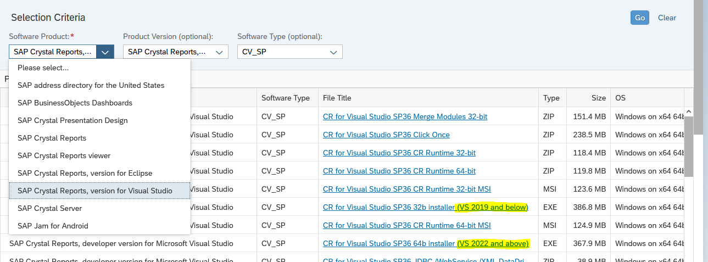

- [Instalaciones](#instalaciones)
  - [Desarrollo](#desarrollo)
    - [Paso a paso](#paso-a-paso)
    - [Validar instalación](#validar-instalación)
  - [Servidor](#servidor)
- [Configuración](#configuración)
- [Enlaces de interés](#enlaces-de-interés)

# Instalaciones

Los instaladores se encuentran en la [página de descargas](https://origin.softwaredownloads.sap.com/public/site/index.html) de SAP.

## Desarrollo

En la máquina de desarrollo se debe instalar el SDK para el Visual Studio; **CRforVS6413SP36_0-80007712.EXE** es para VS 2022 o superiores, **CRforVS13SP36_0-80007712.EXE** es para VS 2019 o inferiores.



### Paso a paso

En mi caso tengo instalado VS Community 2022, por ende debo ejecutar el instalador **CRforVS6413SP36_0-80007712.EXE**.


Esperamos a que se autodescomprima los archivos.


Una vez abierta la ventana, damos click en "Next".


Aceptamos los términos de licencia y damos click en "Next".


Damos click en "Next" nuevamente.


Esperamos que se instale.

> En algún momento nos pedirá permisos de administrador, le damos click en aceptar.


Como VS esta construido en 32 bits, necesita el runtime de 32 bits de SAP Crystal Reports 2020, el instalador nos sugiere instalarlo, para aceptar dejamos la casilla marcada y le damos click en "Finish".


Esperamos a que se instale el runtime de 32 bits de SAP Crystal Reports 2020.


Una vez terminada la instalación, verificamos en los programas instalados que se encuentren estos dos registros.


### Validar instalación

Abrimos la solución [ASPNET.VB.sln](../ASPNET.VB.sln) con Visual Studio y damos click derecho sobre el proyecto **ASPNET.VB**, abrimos la sección "Add" y luego "New Item".


Si aparece en la dereca la sección "Reporting" y puedes ver la plantilla "Crystal Reports" significa que esta bien.


Puedes añadir un nuevo reporte o cancelar.

Otra forma de verificar es abriendo el reporte [CrystalReport1.rpt](../ASPNET.VB/CrystalReport1.rpt) que se encuentra en el proyecto **ASPNET.VB**.


Si se visualiza el reporte entonces todo esta bien.

## Servidor

En el servidor generalmente será de 64bits, entonces se debe instalar el runtime **CR13SP36MSI64_0-80007712.MSI**.


# Configuración

Los siguientes bloques son muy importantes en el [Web.config](../ASPNET.VB/Web.config).

```xml
<configSections>
  <sectionGroup name="businessObjects">
    <sectionGroup name="crystalReports">
      <section name="crystalReportViewer" type="System.Configuration.NameValueSectionHandler"/>
    </sectionGroup>
  </sectionGroup>
</configSections>
<appSettings>
  <add key="CrystalImageCleaner-AutoStart" value="true"/>
  <add key="CrystalImageCleaner-Sleep" value="60000"/>
  <add key="CrystalImageCleaner-Age" value="120000"/>
</appSettings>
<businessObjects>
  <crystalReports>
    <crystalReportViewer>
      <!--Si el sitio esta publicado en una ruta distinta a la por defecto, es necesario indicar dónde estan los recursos de report viewer. Ver más: https://help.sap.com/docs/SAP_CRYSTAL_REPORTS,_DEVELOPER_VERSION_FOR_MICROSOFT_VISUAL_STUDIO/0d6684e153174710b8b2eb114bb7f843/45c0992c6e041014910aba7db0e91070.html#resourceuri-->
      <add key="resourceURI" value="http://localhost/aspnet_client/system_web/4_0_30319/crystalreportviewers13"/>
    </crystalReportViewer>
  </crystalReports>
</businessObjects>
```

En el bloque `crystalReportViewer` se pueden modificar algunos comportamientos y configuraciones del Report Viewer. Para más información, ver [Configurando el Web.config](https://help.sap.com/docs/SAP_CRYSTAL_REPORTS,_DEVELOPER_VERSION_FOR_MICROSOFT_VISUAL_STUDIO/0d6684e153174710b8b2eb114bb7f843/45c0992c6e041014910aba7db0e91070.html).

Estos bloques de acontinuación, se agregan automáticamente al interactuar con el Control de Report Viewer, pero es bueno tenerlos presentes tambien, por ejemplo, que la versión del ensamblado sea la misma que la de `CrystalDecisions.CrystalReports.Engine`

```xml
<system.web>
  <httpHandlers>
    <add verb="GET" path="CrystalImageHandler.aspx" type="CrystalDecisions.Web.CrystalImageHandler, CrystalDecisions.Web, Version=13.0.4000.0, Culture=neutral, PublicKeyToken=692fbea5521e1304"/>
  </httpHandlers>
</system.web>
<system.webServer>
  <handlers>
    <add name="CrystalImageHandler.aspx_GET" verb="GET" path="CrystalImageHandler.aspx" type="CrystalDecisions.Web.CrystalImageHandler, CrystalDecisions.Web, Version=13.0.4000.0, Culture=neutral, PublicKeyToken=692fbea5521e1304" preCondition="integratedMode"/>
  </handlers>
  <validation validateIntegratedModeConfiguration="false"/>
</system.webServer>
```

# Enlaces de interés

- Acerca de [SAP Crystal Reports para Visual Studio (.NET)](https://pages.community.sap.com/topics/crystal-reports/visual-studio).