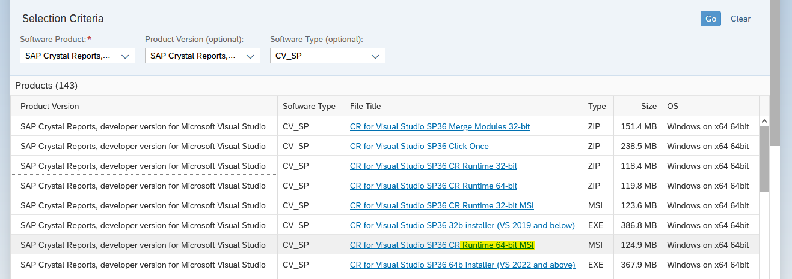

- [Instalaciones](#instalaciones)
  - [Desarrollo](#desarrollo)
  - [Servidor](#servidor)
- [Configuración](#configuración)

# Instalaciones

Los instaladores se encuentran en la [página de descargas](https://origin.softwaredownloads.sap.com/public/site/index.html) de SAP.

## Desarrollo

En la máquina de desarrollo se debe instalar el SDK para el Visual Studio; *CRforVS6413SP36_0-80007712.EXE* es para VS 2022 o superiores, *CRforVS13SP36_0-80007712.EXE* es para VS 2019 o inferiores.


## Servidor

En el servidor generalmente será de 64bits, entonces se debe instalar el runtime *CR13SP36MSI64_0-80007712.MSI*.



# Configuración

Los siguientes bloques son muy importantes en el [Web.config](../ASPNET.VB/Web.config).

```xml
<configSections>
  <sectionGroup name="businessObjects">
    <sectionGroup name="crystalReports">
      <section name="crystalReportViewer" type="System.Configuration.NameValueSectionHandler"/>
    </sectionGroup>
  </sectionGroup>
</configSections>
<appSettings>
  <add key="CrystalImageCleaner-AutoStart" value="true"/>
  <add key="CrystalImageCleaner-Sleep" value="60000"/>
  <add key="CrystalImageCleaner-Age" value="120000"/>
</appSettings>
<businessObjects>
  <crystalReports>
    <crystalReportViewer>
      <!--Si el sitio esta publicado en una ruta distinta a la por defecto, es necesario indicar dónde estan los recursos de report viewer. Ver más: https://help.sap.com/docs/SAP_CRYSTAL_REPORTS,_DEVELOPER_VERSION_FOR_MICROSOFT_VISUAL_STUDIO/0d6684e153174710b8b2eb114bb7f843/45c0992c6e041014910aba7db0e91070.html#resourceuri-->
      <add key="resourceURI" value="http://localhost/aspnet_client/system_web/4_0_30319/crystalreportviewers13"/>
    </crystalReportViewer>
  </crystalReports>
</businessObjects>
```

En el bloque `crystalReportViewer` se pueden modificar algunos comportamientos y configuraciones del Report Viewer.

Estos bloques de acontinuación, se agregan automáticamente al interactuar con el Control de Report Viewer, pero es bueno tenerlos presentes tambien, que la versión del ensamblado sea la misma que `CrystalDecisions.CrystalReports.Engine`

```xml
<system.web>
  <httpHandlers>
    <add verb="GET" path="CrystalImageHandler.aspx" type="CrystalDecisions.Web.CrystalImageHandler, CrystalDecisions.Web, Version=13.0.4000.0, Culture=neutral, PublicKeyToken=692fbea5521e1304"/>
  </httpHandlers>
</system.web>
<system.webServer>
  <handlers>
    <add name="CrystalImageHandler.aspx_GET" verb="GET" path="CrystalImageHandler.aspx" type="CrystalDecisions.Web.CrystalImageHandler, CrystalDecisions.Web, Version=13.0.4000.0, Culture=neutral, PublicKeyToken=692fbea5521e1304" preCondition="integratedMode"/>
  </handlers>
  <validation validateIntegratedModeConfiguration="false"/>
</system.webServer>
```